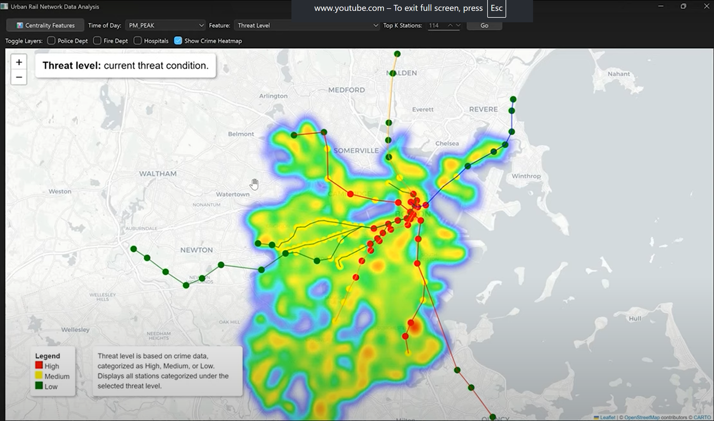

# Machine Intelligence for Threat Deterrence (MBTA GUI)


<a href="[[https://your-destination-link.com](https://www.linkedin.com/feed/update/urn:li:ugcPost:7345461036101124096](https://youtu.be/8ha87dDjb8E?si=A-APYuFNvJfKFziS))">
  
</a>


[](https://youtu.be/8ha87dDjb8E?si=A-APYuFNvJfKFziS)

> **Click the YouTube badge above to watch the demo video!**

## 📋 Overview

A hybrid knowledge-guided network science and machine learning system embedded with behavioral modeling and what-if simulations for predictive understanding of network-level threats leading to risk-informed policy and intervention or investment decisions.

This project focuses on **urban rail network security analysis** using the MBTA (Massachusetts Bay Transportation Authority) as a case study, providing comprehensive threat assessment and attractiveness prediction capabilities.

## 🎯 Key Features

### 🚇 **Urban Rail Network Data Analysis**
- Interactive threat feature mapping with time-of-day analysis
- Crime index visualization and heatmap overlays
- Distance-based analysis from critical infrastructure (police, fire, hospitals)
- Population density and ridership analysis
- Defense posture and threat level assessment

### 🎯 **Rail Station Attractiveness Prediction**
- GCN-LSTM (Graph Convolutional Network - Long Short-Term Memory) model for station attractiveness prediction
- What-if simulation capabilities for threat level and defense posture changes
- Real-time attractiveness score updates across 9 time windows
- Interactive station selection and feature modification

### 🌍 **Global Terrorism Data Visualization**
- Interactive global map of terrorism events targeting rail infrastructure
- Pre/post 9/11 attack analysis and statistics
- Attack type categorization and temporal analysis
- Comprehensive statistics dashboard

### 📊 **Centrality Features Analysis**
- Network centrality metrics visualization
- Graph-based analysis of station importance
- Interactive feature overlays and filtering

## 🛠️ Installation

### Prerequisites
- Python 3.8+
- PyQt6 or PyQt5

### Setup Instructions

1. **Clone the repository**
   ```bash
   git clone <repository-url>
   cd MBTA_GUI
   ```

2. **Create and activate virtual environment**
   ```bash
   python -m venv .venv
   # On Windows:
   .venv\Scripts\activate
   # On macOS/Linux:
   source .venv/bin/activate
   ```

3. **Install dependencies**
   ```bash
   pip install -r requirements.txt
   ```

## 🚀 Usage

### Running the Application

1. **Start the main application**
   ```bash
   python main.py
   ```

2. **Main Interface Options**
   - **Urban Rail Network Data Analysis**: Analyze threat features and crime patterns
   - **Rail Station Attractiveness Prediction**: Predict station attractiveness using ML models
   - **Global Terrorism Data Visualization**: View global terrorism events on rail infrastructure

### Key Functionality

#### Threat Feature Analysis
- Select time of day (9 different time windows)
- Choose features to visualize (crime index, defense posture, population density, etc.)
- Toggle external layers (police stations, fire departments, hospitals)
- Enable crime heatmap overlay
- Filter by top K nodes

#### Attractiveness Prediction
- Select target station and time window
- Modify threat levels or defense posture
- Run GCN-LSTM simulations to predict attractiveness changes
- View real-time updates across all time windows

#### Global Terrorism Data
- Interactive global map with attack locations
- Color-coded pre/post 9/11 attacks
- Detailed statistics and attack type analysis
- Hover tooltips with attack details

## 📁 Project Structure

```
MBTA_GUI/
├── main.py                          # Main application entry point
├── visualizer.py                    # Core visualization engine
├── domirank.py                      # Network analysis utilities
├── requirements.txt                 # Python dependencies
├── page_1_only_map/                # Basic map visualization
├── page_2_map_with_features/       # Feature-enhanced maps
├── page_3_threat_features/         # Main analysis modules
│   ├── threat_features.py          # Threat analysis interface
│   ├── attractiveness_features.py  # ML prediction interface
│   ├── gtd_window.py              # Global terrorism data
│   ├── GCN/                       # Graph neural network models
│   ├── Feature_Label/             # Time-based feature data
│   └── Crime_Data/                # Crime statistics
├── MBTA_graph_data/                # Network topology data
├── Base_Attractiveness_Scores/     # Baseline attractiveness data
├── demo_images/                    # Demo screenshots
└── info_logos/                     # Application logos and graphics
```

## 🔬 Technical Details

### Machine Learning Models
- **GCN-LSTM**: Graph Convolutional Network with Long Short-Term Memory for temporal graph prediction
- **Input Features**: 12-dimensional feature vectors per station
- **Time Windows**: 9 different time periods (VERY_EARLY_MORNING to NIGHT)
- **Output**: Attractiveness scores for each station

### Data Sources
- **MBTA Network Data**: Station locations, connections, and ridership
- **Crime Data**: Boston Police Department crime statistics
- **Global Terrorism Database**: International terrorism events targeting rail infrastructure
- **Infrastructure Data**: Police stations, fire departments, hospitals

### Visualization Technologies
- **Folium**: Interactive map generation
- **PyQt6**: Desktop application framework
- **Matplotlib/Seaborn**: Statistical visualizations
- **NetworkX**: Graph analysis and centrality calculations

## 👥 Team

**Principal Investigators:**
- **Auroop Ganguly** (PI and POC) - Northeastern University & Pacific Northwest National Laboratory
- **Samrat Chatterjee** (Co-PI) - Pacific Northwest National Laboratory & Northeastern University

**Research Team:**
- **Dongqin Zhou** - Postdoctoral Researcher
- **Orijeet Mukherjee** - Graduate Student
- **Soumyo Dey** - Postgraduate Researcher

## 📄 Acknowledgments

This material is based upon work supported by the **U.S. Department of Homeland Security** under Grant Award **22STESE00001-04-00**. The views and conclusions contained in this document are those of the authors and should not be interpreted as necessarily representing the official policies, either expressed or implied, of the U.S. Department of Homeland Security.

## 📞 Contact

For questions or support, please contact the research team through the principal investigators.

---

**Note**: This project is for research and educational purposes. Always ensure compliance with local regulations and data privacy requirements when using this software. 
